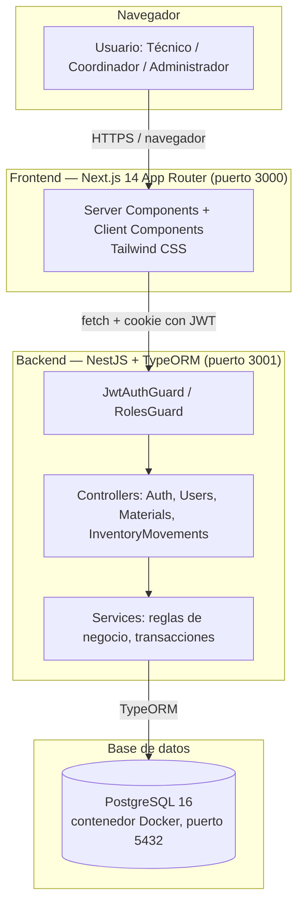
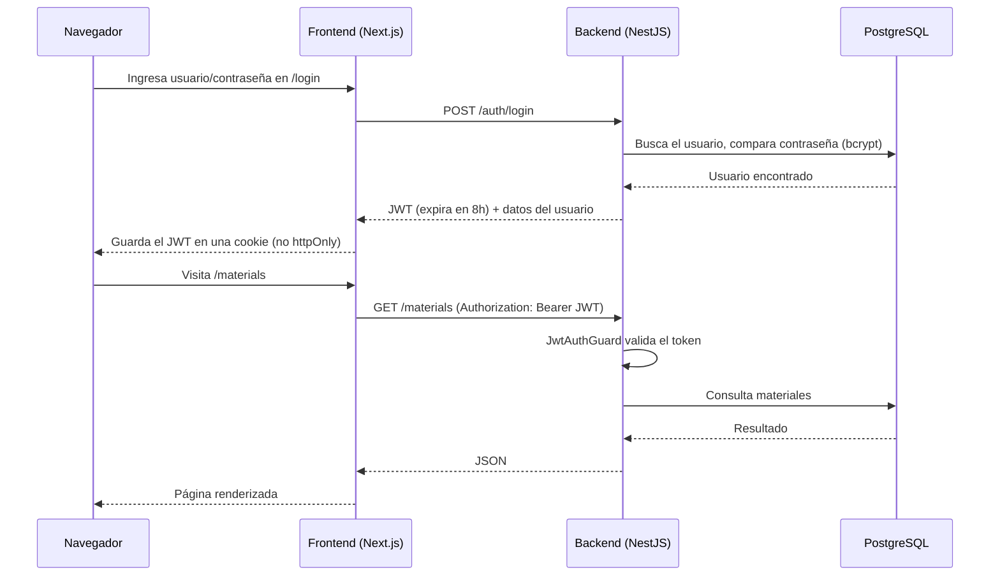
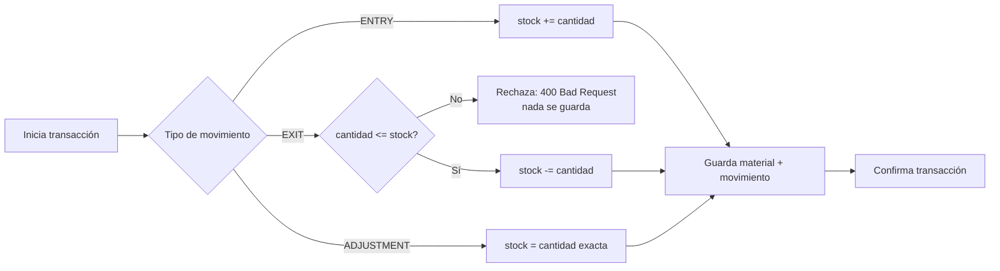

# Arquitectura — ManteStock

Documento de arquitectura para la presentación. Describe el sistema **tal como está implementado y verificado**, no la propuesta original (esa queda en `02-arquitectura-y-capas.md`, con las correcciones ya anotadas).

---

## 1. Vista general

**Tres procesos separados, cada uno corriendo por su cuenta** (no hay contenedores para frontend ni backend, solo para la base de datos):

| Componente | Tecnología | Cómo corre | Puerto |
|---|---|---|---|
| Frontend | Next.js 14 (App Router) + Tailwind CSS | `npm run dev:frontend` (proceso local, no Docker) | `3000` |
| Backend | NestJS + TypeORM | `npm run dev:backend` (proceso local, no Docker) | `3001` |
| Base de datos | PostgreSQL 16 | Contenedor Docker (`docker-compose up`) | `5432` |

---

## 2. Capas y responsabilidades

| Capa | Responsabilidad | Ejemplo concreto |
|---|---|---|
| **Frontend** | Mostrar datos, capturar formularios, mantener la sesión (cookie con el JWT) | `MaterialForm.tsx` valida que el usuario llene los campos y llama al backend |
| **Backend — Controllers** | Recibir la petición HTTP, aplicar guards de autenticación/rol | `MaterialsController` exige `JwtAuthGuard` en todos sus endpoints |
| **Backend — Services** | Aplicar las reglas de negocio reales | `InventoryMovementsService.calculateNewStock()` decide cómo cambia el stock según el tipo de movimiento |
| **Backend — TypeORM** | Traducir objetos a filas de la base de datos | Entidades `Material`, `InventoryMovement`, `User` |
| **Base de datos** | Persistir la información de forma durable | PostgreSQL, con `synchronize: true` en desarrollo (crea las tablas automáticamente) |

El frontend **nunca** habla directo con la base de datos — todo pasa por el backend, que es el único que aplica las reglas (por ejemplo, que una salida no puede superar el stock disponible).

---

## 3. Autenticación y seguridad

Puntos clave, verificados en código:

- **Contraseñas**: hash con `bcrypt` (nunca texto plano).
- **Bloqueo por intentos fallidos**: 2 intentos seguidos incorrectos bloquean la cuenta 5 minutos (`AuthService`).
- **JWT**: firmado con `JWT_SECRET` (variable de entorno), expira en 8 horas.
- **Guards**: `JwtAuthGuard` protege Materials, Inventory Movements y Users. `RolesGuard` + `@Roles(ADMIN)` protege exclusivamente el módulo de Usuarios.
- **Sin restricción de rol** sobre Materiales/Inventario: cualquier usuario autenticado (Técnico, Coordinador o Admin) puede operarlos — decisión de alcance documentada, no un descuido.
- **Cookie no-httpOnly** en el frontend: trade-off aceptado para el MVP (necesario porque los Server Components y el middleware de rutas de Next.js necesitan leerla); documentado como punto a revisar si el proyecto llega a producción real.

---

## 4. Patrón de transacciones (por qué el inventario nunca queda inconsistente)

Todo movimiento de inventario se ejecuta dentro de una transacción de base de datos (`DataSource.transaction()`), no como dos pasos sueltos:

Si algo falla a mitad de camino, no queda ni el movimiento guardado ni el stock a medias — se revierte todo. Los movimientos, además, son **inmutables**: no existen endpoints `PUT`/`DELETE` para ellos, ni siquiera para el rol Administrador.

---

## 5. Decisiones de arquitectura relevantes (con fecha, ver detalle en `CLAUDE.md`)

| Decisión | Fecha | Por qué |
|---|---|---|
| ORM: TypeORM, no Prisma (el plan original mencionaba Prisma) | histórica | Elegido al iniciar el backend; el resto de la documentación original quedó anotada, no reescrita. |
| `createdBy` como texto plano, no relación FK a `User` | 21/07/2026 | Evita joins innecesarios y el riesgo de exponer `passwordHash` al popular la relación. |
| Cookie no-httpOnly para el JWT en frontend | 21/07/2026 | Única forma viable de que Server Components y middleware lean la sesión sin reescribir todo a Client Components. |
| Sin tabla `Sessions` | histórica | JWT sin estado (stateless) — se valida por firma, no se persiste sesión en base de datos. |
| Notificaciones fuera de alcance | 21/07/2026 | Decisión explícita del equipo, no un pendiente. |
| Gitflow: rama `feature/checkpoints-007-010`, sin merge a `main` todavía | 22/07/2026 | La metodología del curso exige rama + Pull Request + Code Review antes de tocar `main`. |

---

## 6. Documentos relacionados

- Modelo de datos real: [`ERD.md`](./ERD.md)
- Requisitos y alcance: [`PRD.md`](./PRD.md)
- Historias de usuario: [`HISTORIAS-DE-USUARIO.md`](./HISTORIAS-DE-USUARIO.md)
- Detalle por módulo: carpeta [`specs/`](./specs/)
- Bitácora completa de decisiones y checkpoints: [`CLAUDE.md`](./CLAUDE.md)
