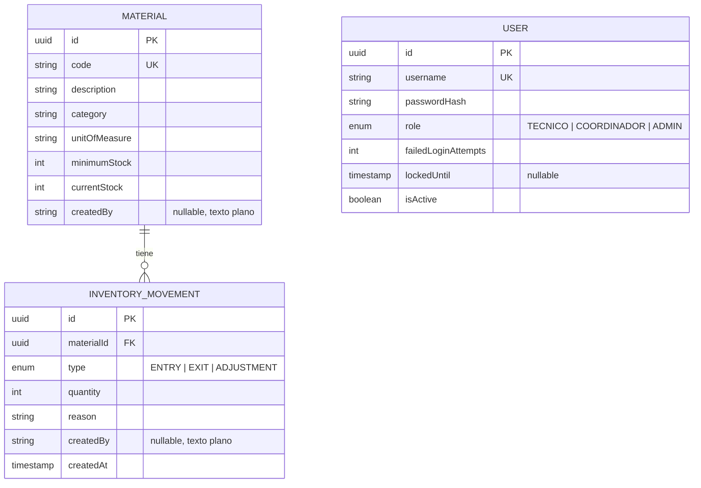

# ERD — ManteStock (modelo real implementado)

Este diagrama refleja las entidades **tal como están implementadas en el código** (`apps/backend/src/*/entities/*.ts`), no el modelo original planeado en `04-modelo-de-datos.md`. Hay diferencias deliberadas respecto a ese documento original — ver la sección de discrepancias más abajo.

## Nota sobre `USER` y `createdBy`

`USER` no tiene una relación formal (FK) con `MATERIAL` ni con `INVENTORY_MOVEMENT` — por eso no aparece conectada con líneas en el diagrama. El campo `createdBy` de ambas entidades guarda el **username en texto plano**, capturado en el momento de creación del registro, no una referencia relacional al `id` del usuario.

**Por qué se decidió así (documentado en `CLAUDE.md`, 21/07/2026):** evita joins innecesarios y el riesgo de exponer `passwordHash` al popular una relación por accidente. Es suficiente para la trazabilidad que pide el sistema (saber qué usuario hizo cada cosa), sin necesidad de una relación real. Contrapartida aceptada: si un usuario cambiara de `username` en el futuro, los registros antiguos no se actualizarían retroactivamente (hoy no existe esa función, así que no aplica todavía).

## Discrepancias respecto al modelo original (`04-modelo-de-datos.md`)

| Modelo original (planeado) | Modelo real (implementado) | Motivo |
|---|---|---|
| Tabla `Roles` separada, `Users.role_id` como FK | `role` es un enum directo en `User` (`TECNICO`/`COORDINADOR`/`ADMIN`) | Simplificación de MVP — 3 roles fijos no ameritan una tabla aparte. |
| Tabla `Categories` separada, `Materials.category_id` como FK | `category` es texto libre en `Material` | Simplificación de MVP, aceptada explícitamente. |
| Tabla `Sessions` (id, user_id, token, expires_at) | No existe | La autenticación usa JWT sin estado (stateless) — el token se valida por firma, no se persiste sesión en base de datos. |
| `Materials.created_by`, `InventoryMovements.created_by` como parte del modelo desde el inicio | Se agregaron después, en el checkpoint de Autenticación (007.4), como texto plano | El modelo original ya los contemplaba conceptualmente; se implementaron cuando existió el módulo de usuarios del cual depender. |
| `quantity`/`current_stock`/`minimum_stock` sin tipo explícito | `int` en ambas entidades | Diferido — el documento original pedía soporte de decimales (kg, litros fraccionados); se mantiene entero para esta versión, revisar si se agrega unidad de medida fraccionable más adelante. |

## Restricciones activas (verificadas en código y con Postman)

- `Material.code` es único — violación devuelve `409 Conflict`.
- `Material.currentStock` nunca se recibe directamente del cliente en creación/edición — siempre lo calcula `InventoryMovementsService` dentro de una transacción.
- `InventoryMovement` es inmutable: no existen `PUT`/`DELETE` en el controller, y el service rechaza esas operaciones si se invocan directamente.
- `User.username` es único — violación devuelve `409 Conflict`.
- `User.isActive` es baja lógica — `DELETE /users/:id` nunca borra la fila físicamente.
